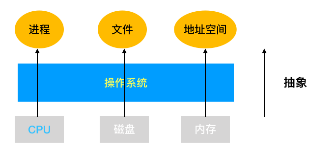
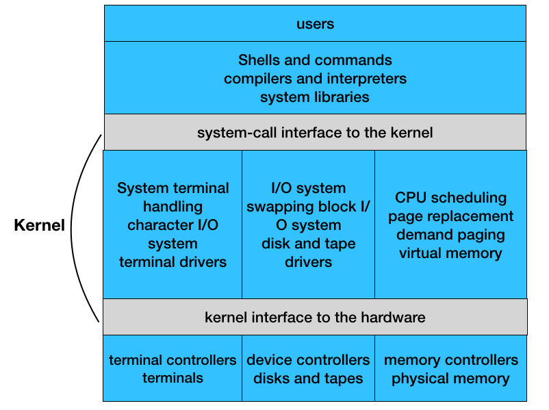

# 讲义 1
# 1.1 课程概述
+ 基本概念及原理
  - 操作系统介绍
  - 中断及系统调用
  - 内存管理
  - 进程及线程
  - 调度
  - 同步
  - 文件系统
  - I/O子系统
+ 练习
  - 在ucore操作系统上的实验
  - [github](https://github.com/chyyuu)
    1. 实验0： 准备
    2. 实验1： 系统启动及中断
    3. 实验2： 物理内存管理
    4. 实验3： 虚拟内存管理
    5. 实验4： 内核线程管理
    6. 试验5： 用户进程管理
    7. 实验6： CPU调度
    8. 实验7： 同步与互斥
    9. 实验8： 文件系统
+ 延伸
  - 讨论一些相关话题或故事

+ 预备知识
  - 计算机结构原理（Intel 80386+）
  - 数据结构
  - C和汇编语言
# 1.2 什么是操作系统
+ 没有一个完整，精确，公认的定义
+ 从功能和特点来介绍操纵系统
**（对上，对应用程序/用户，从控制角度，）**
  - 操作系统式一个控制软件
  - 管理应用程序
  - 为应用程序提供服务
  - 杀死应用程序
  
  例如： 在windows操作系统为各种桌面应用程序提供服务：
  
  
**（对下，硬件资源）**  
  - 资源管理
  - 管理外设，分配资源
  
  
+ 操作系统架层次结构（中间层系统软件）
  - 硬件之上
  - 应用程序之下
  
  
+ 操作系统在软件中的位置
  - 应用软件： 办公软件，视频播放软件
  - OS 位于应用软件之下，为应用软件提供服务支撑
  
  **utility**: 特定功能软件，如编译器，动态共享库。。。
  **OS**： 完成对硬件的控制和管理，更复杂繁琐
  - OS 分两部分
    1. Shell： 对外，面向应用程序，入linux，windows，android的GUI。
    2. kernel： 对内，管理硬件资源。（课程重点）
+ 硬件资源：三大块 ->  **kernel** os内部组件
  - CPU：CPU调度，进程，线程管理
  - Memory：物理内存管理，虚拟内存管理
  - 硬盘/disk：以磁盘块为基本单元，不容易直接操作->抽象出文件系统:文件系统管理
  - 其他：中断处理与设备驱动（底层硬件相关）
  
  
  
