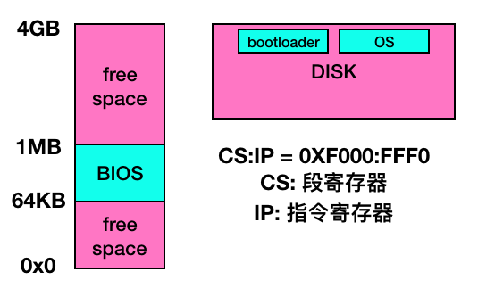
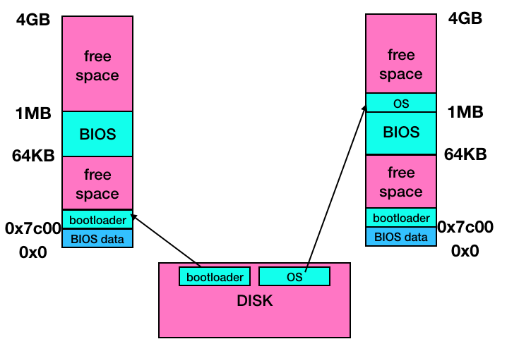

# Chapter 2
# 2.1 操作系统的启动，中断，异常和系统调用
+ 启动 
  - 计算机系统结构概述
    
  - 计算机的内存和硬盘布局
    + DISK: 存放OS
    + BIOS: 基本I/O处理系统 -> 开机检查外设
    + bootloader: 加载OS
    
  - 开机顺序：
  
    + POST(加电自检)：寻找显卡，键盘鼠标等初始化检查
    + BIOS将bootloader从磁盘的引导扇区（512字节）加载到0x7c00，跳转到CS:IP = 0000:0x7c00
    + bootloader将操作系统的代码和数据从磁盘加载到内存中
    + 将控制权交还OS，OS开始正常工作
        
    
+ 中断，异常和系统调用： OS与设备和程序交互
  - 背景
  - 三者相比较
  - 中断和异常处理机制
  - 系统调用的概念
  - 系统调用的实现
  - 程序调用和系统调用的不同之处
  - 开销
  
  - OS的interface有三个
    + 中断 面向 外设
    + 系统调用和异常 面向 用户程序
  - 定义
    + 系统调用
      - 来源于应用程序
      - 应用程序主动向操作系统发出服务请求
    + 异常
      - 来源于不良的应用程序
      - 非法指令或者其他坏的处理状态（如内存出错。。。）
    + 中断
      - 来源于外设
      - 来自不同的硬件设备的计时器和网络的中断
  - 为什么应用程序不直接访问外设？
    + 在计算机运行中，内核是被信任的
    + 只有内核可以执行特权指令（这两点是安全性考虑）
    + 为了方便应用程序，屏蔽底层硬件的复杂性和差异性（高效性）
  - OS 如何设计和实现中断，异常，和系统调用（以后章节）
  - 三者有何区别和特点
    + 源头：
      - 中断： 外设（键盘，网卡（网络包事件），声卡，显卡。。。）
      - 异常： 应用程序意想不到的行为 （除零，恶意程序访问别的程序的地址空间，资源得不到满足。。。）
      - 系统调用： 应用程序主动请求OS提供服务 （明确指令和参数，例如打开文件，发送网络包。。。）
    + 处理时间
      - 中断： 异步（OS不知道何时产生中断）
      - 异常： 同步（执行特定指令一定会产生）
      - 系统调用： 异步（有时候返回是异步的，比如应用程序请求系统调用之后去做别的事情）或同步（产生一定是同步，返回一般也是同步）
    + 响应
      - 中断： 持续，对应用程序是透明的（应用程序感觉不到中断）
      - 异常： 杀死或者重新执行意想不到的应用程序指令
      - 系统调用： 等待和持续
# 2.2 中断，异常和系统调用
+ 中断和异常的处理机制
