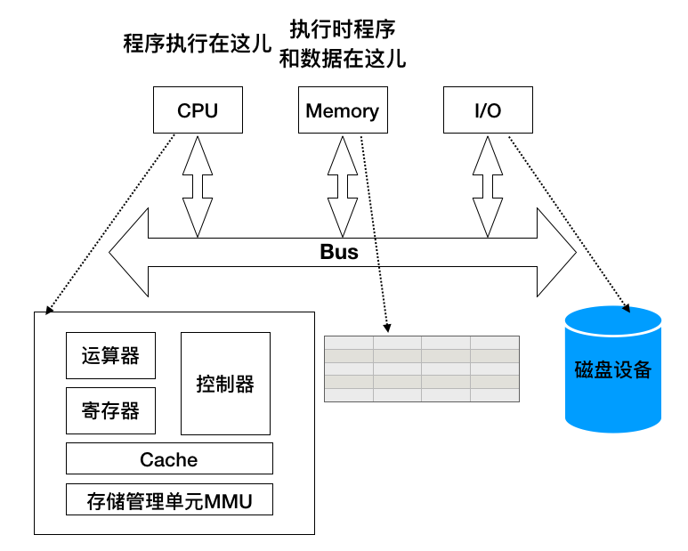
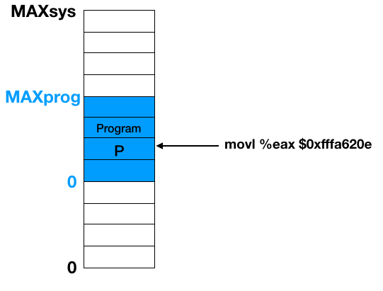

# 3 OS如何管理物理内存
+ 计算机体系结构及内存分层体系
+ 地址空间和地址生成
+ 连续内存分配

# 3.1 计算机体系结构及内存分层体系
+ 计算机体系结构
  - CPU
  - Memory
  - I/O
  
+ 内存分层体系: cpu要访问的指令或者数据所处的位置
  - 寄存器/cache: 
    + OS无法直接管理
    + 速度快
    + 容量小
  - 主存/物理内存
    + 容量大很多
    + 速度相对慢
  - 硬盘
    + 永久保存数据
    + 容量大
    + 速度慢
  - 容量和速度似乎鱼和熊掌不可兼得， 但在OS 帮助之下， 可以完成近乎不可能完成的任务。(4个目标)
    + 抽象
    + 保护
    + 共享
    + 虚拟化
    
  - OS管理内存的不同方法
    + 程序重定位
    + 分段
    + 分页
    + 虚拟内存
    + 按需分页虚拟内存
  - 实现高度依赖于硬件
    + 必须知道内存架构
    + MMU：内存管理单元，硬件组件负责处理CPU的内存访问请求

+ 在OS的内存管理范例

# 3.2 地址空间与地址生成
+ 地址空间的定义
+ 地址生成
+ 地址安全检查（各个进程不相互干扰）
## 地址空间
+ 物理地址空间
  - 硬件支持的地址空间
    + 主存
    + 硬盘
  - 起始地址 0， 到地址 MAX_sys
+ 逻辑地址空间
  - 一个运行程序所拥有的内存范围
  - 起始地址 0， 到MAX_prog
  
  
  
