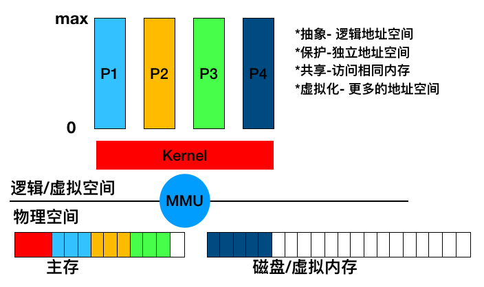
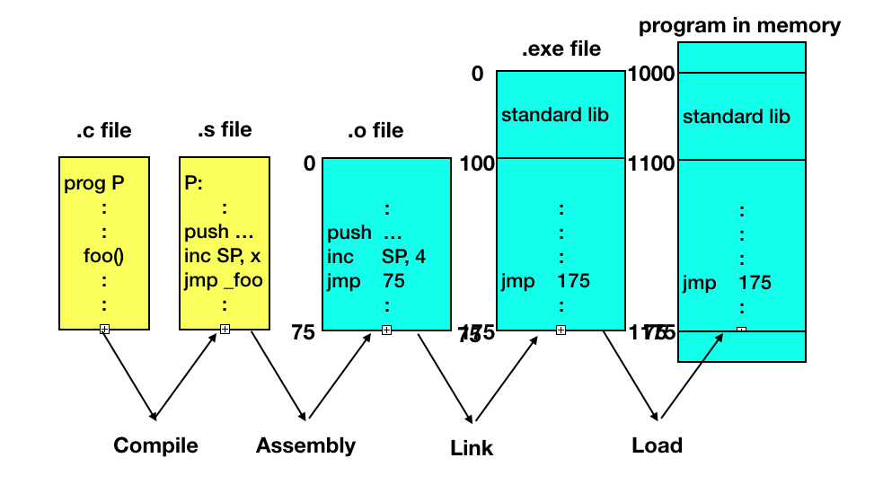
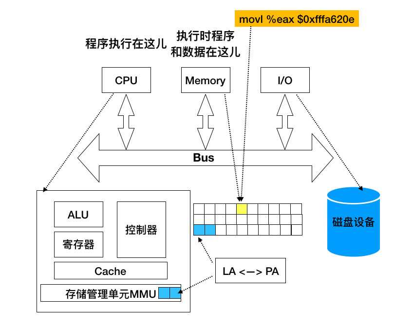

# 3 OS如何管理物理内存
+ 计算机体系结构及内存分层体系
+ 地址空间和地址生成
+ 连续内存分配

# 3.1 计算机体系结构及内存分层体系
+ 计算机体系结构
  - CPU
  - Memory
  - I/O
  
+ 内存分层体系: cpu要访问的指令或者数据所处的位置
  - 寄存器/cache: 
    + OS无法直接管理
    + 速度快
    + 容量小
  - 主存/物理内存
    + 容量大很多
    + 速度相对慢
  - 硬盘
    + 永久保存数据
    + 容量大
    + 速度慢
  - 容量和速度似乎鱼和熊掌不可兼得， 但在OS 帮助之下， 可以完成近乎不可能完成的任务。(4个目标)
    + 抽象
    + 保护
    + 共享
    + 虚拟化
    
  - OS管理内存的不同方法
    + 程序重定位
    + 分段
    + 分页
    + 虚拟内存
    + 按需分页虚拟内存
  - 实现高度依赖于硬件
    + 必须知道内存架构
    + MMU：内存管理单元，硬件组件负责处理CPU的内存访问请求

+ 在OS的内存管理范例

# 3.2 地址空间与地址生成
+ 地址空间的定义
+ 地址生成
+ 地址安全检查（各个进程不相互干扰）
## 地址空间
+ 物理地址空间
  - 硬件支持的地址空间
    + 主存
    + 硬盘
  - 起始地址 0， 到地址 MAX_sys
+ 逻辑地址空间
  - 一个运行程序所拥有的内存范围
  - 起始地址 0， 到MAX_prog
  
  
+ 映射关系由OS决定  
+ 逻辑地址生成： 符号逻辑地址到内存中实际逻辑地址
  - .c file: 变量名，函数位置即地址
  - .s file: 汇编语言仍然使用变量名为地址
  - .o file: 机器语言起始地址为0， 变量函数符号等转换为相应的从零开始的地址
  - .exe file: 不同的 .o 程序变为单一执行程序，不同.o程序中的地址做全局分布
  - 内存中的程序: 使用loader将exeload到内存中，加上一个偏移量，仍为逻辑地址
 
  
+ 物理地址生成：
  - 
  - CPU 方面：
    + 运算器ALU需要在逻辑地址的内存内容，发出请求，参数为逻辑地址
    + 内存管理单元寻找在逻辑地址和物理地址之间的映射，MMU中没有就去内存中去找（图中蓝色部分，cpu蓝色部分为映射缓存，存储了LA->PA的映射关系）
    + 控制器从总线发送在物理地址的内容的请求
  - 内存方面
    + 内存发送物理地址内存的内容给cpu
  - OS方面
    + 建立逻辑地址和物理地址的映射
    + 对地址空间访问的限制和约束，保证访问的合法：设置逻辑地址空间的基址和界限(也存在一个表中)
       - 

# 3.3 连续内存非配： 内存碎片与分区的动态分配

连续内存分配
+ 内存碎片问题
+ 分区的动态分配
  - 第一适配
  - 最佳适配
  - 最差适配
+ 压缩式碎片整理
+ 交换式碎片整理

## 内存碎片问题
+ 空闲内存不能被利用
+ 外部碎片
  - 在分配单元间的未被使用的内存
+ 内部碎片
  - 在分配单元中的未被使用的内存
  

### 分区的动态分配
+ 简单的内存管理方法：
  - 当一个**程序**准许运行在内存中时，分配一个连续的区间
  - 分配一个连续的内存区间给运行的程序以访问**数据**
+ OS 跟踪
  - 满块
  - 空块
+ 分配策略（example: 分配400字节）
  - 首次适配（first fit）
    + 为了分配n字节，使用第一个可用空闲块以致块的尺寸比n大  
    
    + 基本原理和实现
      - 简单实现
      - 需求：
        + 按地址排序的空闲块列表
        + 分配需要寻找一个合适的分区
        + 重分配需要检查，看是否自由分区能合并于相邻的空闲分区（若有）
      - 优点
        + 简单
        + 易于产生更大的空闲块，向着地址空间的结尾
      - 劣势
        + 外部碎片随着内存释放而家具
        + 不确定性
  - 最优适配
    + 使用最小的可用空闲块
    
    + 基本原理和实现
      - 为了避免分割大空闲块
      - 为了最小外部碎片产生的尺寸
    + 需求
      - 按尺寸排列的空闲块列表
      - 分配需要寻找一个合适的分区
      - 重分配需要搜索及合并于相邻的空闲分区（若有）
    + 优势
      - 当大部分分配是小尺寸时非常有效
      - 比较简单
    + 劣势
      - 外部碎片
      - 重分配慢
      - 易产生很多没有用的微小碎片（不怎么好）
  - 最差适配（worst fit）
    + 使用最大可用空闲块
    
    + 基本原理和实现
      - 为了避免有太多微小的碎片
      - 需求
        + 按尺寸排列的空闲块列表
        + 分配很快（获得更大的分区）
        + 重分配需要合并于相邻的空闲分区，然后调整空闲块列表
    + 优势
      - 假如分配是中等尺寸效果最好
    + 劣势
      - 重分配慢
      - 外部碎片
      - 易于破碎大的空闲块以至于大分区无法被分配
+ 这三种都是简单内存算法。
  
