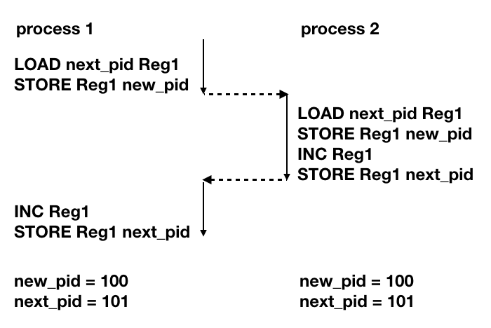

# 9 同步
+ 背景
+ 基本概念
+ 临界区（critical section）
+ 方法1： 禁用硬件中断
+ 方法2： 基于软件的解决方法
+ 方法3： 更高级的抽象
## 9.1 背景 
+ 目前为止
  - 多道程序设计（multi-programming）： 现代操作系统的重要特性
  - 并行很有用
  - 进程/线程: OS抽象出来用于支持多道程序设计
  - cpu调度： 实现多道程序设计的机制
  - 调度算法： 不同的策略
+ 本周和下周
  - 协同多道程序设计和并发问题
  
  
+ 独立的线程
  - 不和其他线程共享资源或状态
  - 确定性：输入状态决定结果
  - 可重现： 能够重现起始条件，I/O
  - 调度顺序不重要
+ 合作线程
  - 在多个线程中共享状态
  - 不确定性
  - 不可重现
  
 + 不确定性和不可重现意味着BUG可能是间歇性发生的

### 进程/线程 计算机/设备需要合作
+ 优点 1： 共享资源
  - 一台电脑多个用户
  - 一个银行存款余额，多台ATM
  - 嵌入式系统（机器人控制：手臂和首的协调）
+ 优点 2： 加速
  - I/O 操作和计算可重叠
  - 多处理器：将程序分成多个部分并行执行
+ 优点3： 模块化
  - 将大程序分解成小程序
    + 以编译为例，gcc会调用cpp, ee1,ee2,as,ld
    + 使系统易于扩展
    
### example
+ 程序可以调用函数fork()来创建一个新的进程
  - OS需要分配一个新的并且唯一的进程ID
  - 因此在内核中， 这个系统会调用运行
  
  ~~~~
  new_pid = next_pid++;
  ~~~~
  
  - 翻译成机器指令
  
  ~~~~
  LOAD next_pid Reg1
  STORE Reg1 new_pid
  INC Reg1
  STORE Reg1 next_pid
  ~~~~
  
+ 假设两个进程并发执行
  - 如果next_pid等于100，那么其中一个进程得到的ID应该是100，另一个得到101，next_pid=102

  - 无论多个线程的指令顺序怎样交替执行，程序都必须工作
    + 多线程程序具有不确定性和不可重现的特点
    + 不经过专门设计，**调试难度很高**
  - 不确定性要求并行程序的正确定
    + 先思考清楚问题，把程序的行为设计清楚
    + 切记急于着手编写代码，碰到问题再调试
## 9.2 一些概念 Part 1
**Race Condition** (竞态条件)
+ 系统缺陷： 结果依赖于并发执行或者事件的顺序/时间
  - 不确定性
  - 不可重现
+ 怎样避免竞态？
  - 让指令不被打断
**Atomic Operation** (原子操作)
+ 原子操作是指一次不存在任何中断或者失败的执行
  - 该执行成功结束
  - 或者根本没有执行
  - 并且不应该发现任何部分执行的状态
+ 实际上操作往往不是原子的
  - 有些看上去是原子操作，但并不是
  - 连 x++ 这样简单的语句，实际上是3条指令构成
  - 有时候甚至连单条机器指令都不是原子的
    + Pipeline, super-scalar, out-of-order, page fault
    
### example：
+ A 和 B两个线程互相竞争
  - 其中一个尝试使一个共享的计数器+1
  - 另外一个尝试使一个共享的计数器-1

~~~~
/*i： 共享全局变量*/
i = 0;                        i = 0;
while(i<10)                   while(i<10)
  i = i + 1;                    i = i - 1;
printf("A wins");             printf("B wins");
~~~~
+ 假设内存读取和存储是原子的，但是 +1 和 -1 操作不是原子的
+ 谁赢？ A, B or **running forever**
  - i = i + 1; and i = i - 1; 交替运行
+ 能保证有人赢吗？

### Critical Section(临界区)
临界区是指进程中的一段需要访问共享资源并且当另个进程处于相应代码区域时不会被执行的代码区域
### Mutual exclusion(互斥)
当一个进程处于临界区并访问共享资源时，没有其他进程会处于临界区并且访问任何相同的共享资源
### Dead Lock(死锁)
两个或以上的进程，在相互等待完成特定任务，而最终没法将自身任务执行下去
### Starvation(饥饿)
一个可执行的进程，被调度器持续忽略，以至于虽然处于可执行状态却不被执行

## 9.3 一些概念 Part 2
+ OS中的问题和现实生活中的问题的类比
  - 更好的帮助你理解现实生活中的问题
  - 但是，计算机比人更蠢
+ 例如： 人需要协调
  - 面包为共享全局变量

|时间|Person A|Person B|
|----|----|----|
|3:00|查看冰箱，没有面包||
|3：05|离开家去商店||
|3：10|到达商店|查看冰箱，没有面包|
|3：15|购买面包|离开家去商店|
|3：20|到家，把面包放进冰箱|到达商店|
|3：25||购买面包|
|3：30||到家，把面包放进冰箱|

+ 什么是 “面包太多问题”的正确性质？
  - 最多一个人去买面包
  - 如果需要，有人去买面包
+ 例如，在冰箱上设置一个锁和钥匙（lock & key） 
  - 去买面包之前锁住冰箱并且拿走钥匙
  - 修复了“太多”的问题：要是有人想要果汁怎么办
  - 可以改变“锁(lock)”的含义
  - “锁(lock)”包含“等待(waiting)”
  
+ lock(锁)：在门，抽屉等物件上加上保护性装置，使得外人无法访问物体内的东西，只能等待解锁后才能访问
+ unlock（解锁）：打开保护性装置，使得可以访问之前被锁保护的东西
+ deadlock（死锁）：A拿到锁1，B拿到锁2，A想继续拿到锁2后再继续执行，B想继续拿到锁1后再继续执行。导致A和B谁也无法继续执行。

### 使用**便签**来避免购买太多面包
+ 购买之前留下一张便签（一种“锁(lock)”）
+ 买完后移除该便签（一种“解锁(unlock)”）
+ 如果存在便签就不要购买面包（在便签被移除之前一直等待）
+ 程序样例

~~~~
if(nobread){
  if(noNote){
    leave Note;
    buy bread;
    remove bread;
  }
}
~~~~
+ 有效吗？

~~~~
if(nobread){      （1）                                
  if(noNote){      (2）         
                           （3） if(nobread){
                            (4）   if(noNote){ 
          
    leave Note;    (5）
                            (6）      leave Note;                          
    buy bread;                        buy bread;
    remove note;                      remove note;   
  }                                }
}                               }
~~~~

+ 结果
  - 偶尔情况下还是会购买太多面包
  - 线程可以得到检查面包和便签之后，购买面包之前切换上下文
+ 该解决方案由于会间歇性的失败，使得问题更糟了
  - 使得问题更加难以调试
  - 必须做调度器所做的事情
  
+ 清楚的表明便签无法完全阻塞

### 快速修复：将leave note放在第一位

  
~~~~
leave note;         (1)
                          (2)  leave note;
if(nobread){        (3)  
                          (4)  if(nobread){        
  if(noNote){      （5）
                         （5）
    buy bread;                    if(noNote){
    remove bread;                   buy bread; 
  }                                 remove bread;
}                                 }  
                                }
~~~~

会发生： 不会有人买面包

### 为便签增加标签（谁放置的标签）
+ 现在则可以在检查之前留便签
+ 算法如下
  
  
  
  
